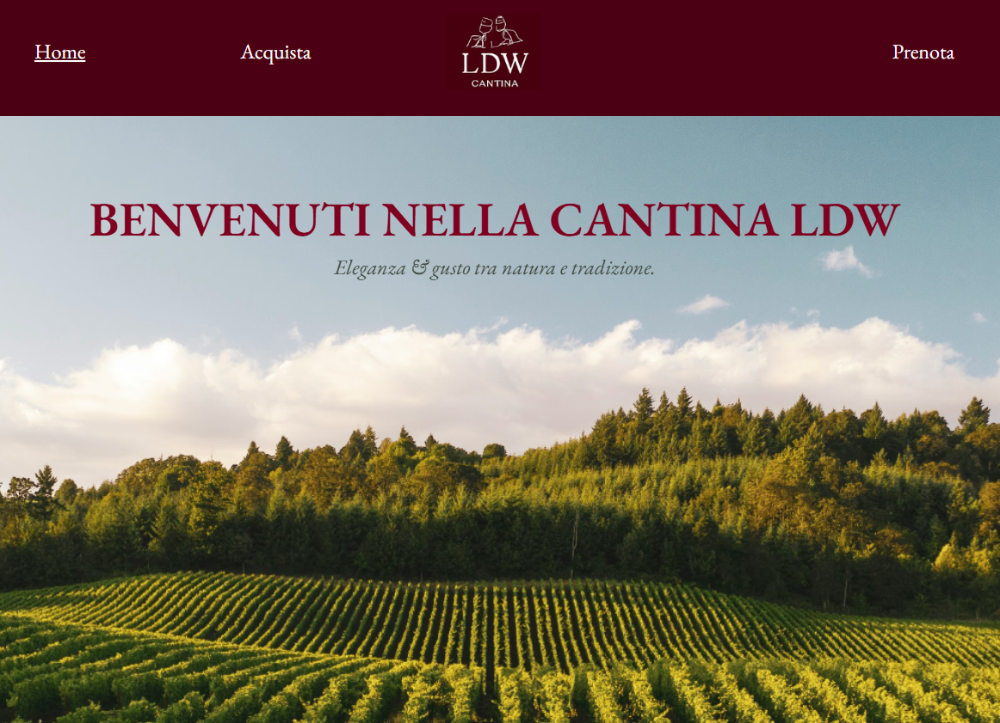

# 🍷 LDW Vineyard – Template Landing Page per Cantine e Attività Locali

Benvenuto nel sito **LDW Vineyard**, una landing page moderna e responsive realizzata con [Framer](https://www.framer.com/).  
Pensata per una cantina toscana, ma **facilmente adattabile** ad altre attività locali: agriturismi, ristoranti, wedding venues, B&B o tour enogastronomici.

🔗 **[Demo online](https://awesome-autonomy-101658.framer.app/)**  
📸 Guarda la preview più in basso!

---

## ✨ Caratteristiche

- Layout elegante e immersivo
- Ottimizzato per desktop e mobile
- Sezioni già pronte: chi siamo, vini, contatti, prenotazione
- Testi e struttura **localizzati in italiano**
- Facile da personalizzare con Framer o da replicare in altri builder

---

## 🖼️ Screenshot

---

## 🔧 Utilizzi alternativi

Questo template può essere riadattato per:

- Agriturismi e ristoranti
- Attività locali con vocazione naturale/artigianale
- Eventi privati (matrimoni, degustazioni, tour)
- Pagina vetrina per attività turistiche

---

## 📦 Struttura del progetto

La versione live è stata realizzata con Framer.  
Puoi:
- visitare la demo online
- clonare lo stile e struttura nel tuo Framer
- usare il design come base per progetti simili

---

## 🙋‍♂️ Autore

**LDW Studio** – Creo soluzioni moderne e leggere per attività locali e freelance.  
Mi occupo di web design, automazioni e micro-tool per e-commerce.

📩 luca@arredoweb.com  
🌐 [ldwstudio.github.io](https://ldwstudio.github.io)

---

## 📄 Licenza

Questo progetto è distribuito con licenza [MIT](LICENSE).
